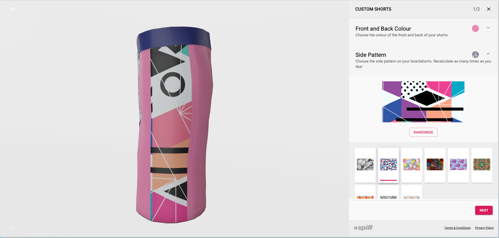
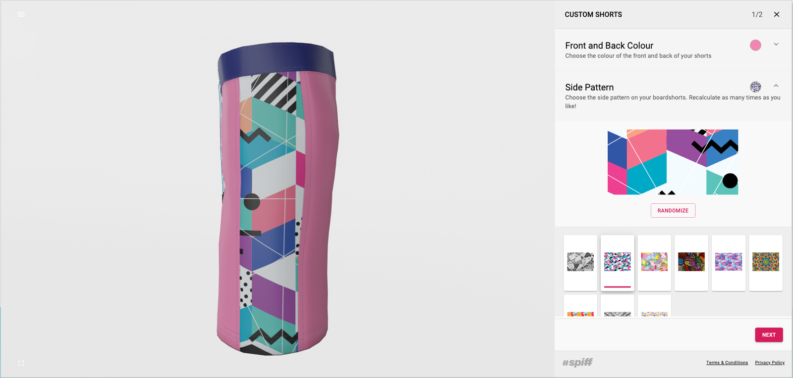

#### Every user gets a unique version of your ART.   
Do you have a detailed graphic or a large mosaic picture? If so, using patchworks you can give every person a unique portion of that image to set in your product. Most popular examples have been Mosaic Diet Coke or Mosaic Nutella. Check your assets repository, we give a few examples to use for free!

Complexity = Advanced (only in that you need a highly detailed image for this step to be effective) 

#### Examples: 
- Wine Bottle Background - Your unique "popular artist" background of this well known image ?
|||

#### How to Create
- Click on Add Patchworks Step within a workflow. 
- Add your Title (E.g. Artistict background)
- Add your Help Text (E.g.Get your own unique piece of this famous art as a background to your customized bottle)
- Add your option by either selecting a pre-made option or create a new one by clicking add variant (Art Mosaic 1, Art Mosaic 2 etc).
- Save Step

_Important note: Spiff provides you with examples that you can use in your workflow. Simply go to options and create a patchwork option and link the variants in the patchworks folder._

This step could be part of the standard workflow available to all or it could be linked as a conditional step by clicking the conditional button at the bottom of the step setting it to only appear when a particular variant in a previous step is selected. 

#### Customization or Personalization ?
The Material step is a personalization. A customer selection will be unique and must be printed and applied to the product.