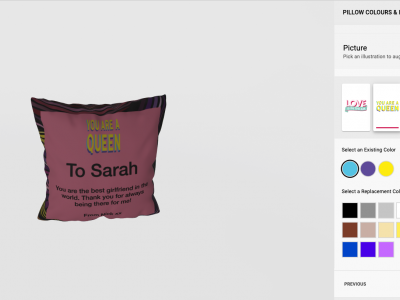
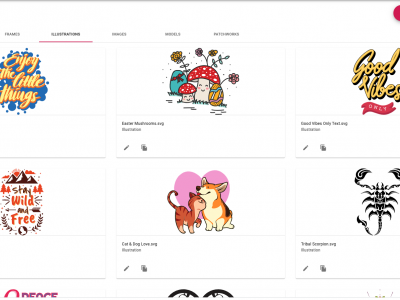

Illustrations are vector art usually drawn in illustrator or a program like it. The spiff editor accepts illustrations in the form of SVG (scaleable vector graphic). 
Example SVGS

||||||  

The advantage of using SVG’s in our editor is that colours that exist within the SVG are easily modified using the spiff UI. The other obvious advantage is that for the purposes of print, SVG’s can be scaled to any size without loosing print quality.

Spiff provides all new merchants with a library of illustrations that can be found in their asset gallery by checking the public assets check box. The user can store their illustrations in the spiff asset gallery. 

The illustrations are linked to merchant workflows by creating a new [option](http://help.spiff.com.au/spiff-concepts/options) and selecting illustration as the option type and then building a list of variants (illustrations) to be displayed in a step on a merchant workflow. 

The ability to set colours on the step is a configurable option

SVG Set Up 
How to set up in illustrator

Unusable SVG's 
Any that have gradients. It there is too much detail
