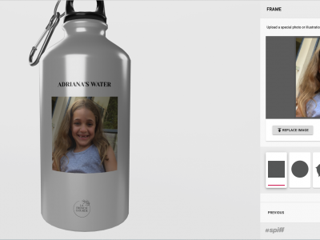
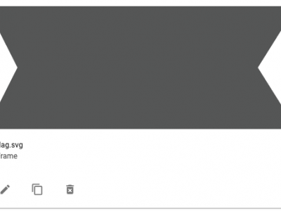
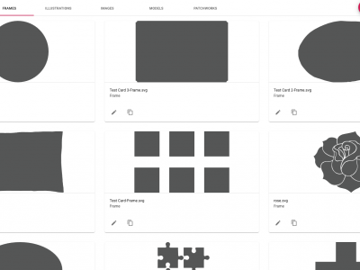
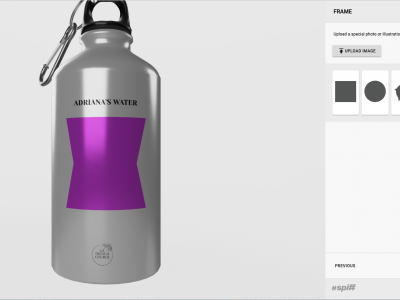
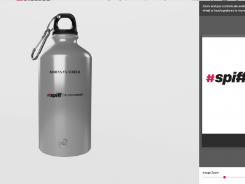

### Frames

Frames render an upload button to a step allowing users to add an image from their device. Frames can be any kind of shape or size which gives users a lot of creative freedom when uploading images.

Like all other Spiff assets we provide you with public library so that you can start building workflows straight away. To see the library of frames simply make sure the **Show public assets** button is checked. Here are some of our existing frames.

This step renders an Upload button allowing the user to add an image from their device. The position is totally configurable to your requirements. 

Accepted User File Types = JPG, PNG and SVG

#### Uploading Frames to fill a defined area 
Images uploaded to spiff are defined by regions. A region is space defined with the panel area. A region has an x and y coordinate value to position the image (top Right corner) on the model and pdf as well as a height and width. These coordinates are also used to build the pdf upon execution of the order.  
Generally merchants will require a standard square frame but it is important to note that this can be any shape or combination of shapes. 
  
Frames are created as grey vectors in illustrator and are exported as SVG’s and uploaded to the Frames TAB in the asset gallery. Only SVG’s in this folder will be able to be used in the upload step. See uploading frames for more help on how to set up an SVG for spiff.

A user can either use one frame or many. If an Option is added (list of variants) to the step to display many frames, the user can choose from a range of shapes. 
  
Note: Frames are vectors and so are sized to be in proportion to the length and width defined by the merchant as the area the frame takes up on the object. This means that a shape uploaded to assets will be distorted to fit within those parameters. 

Eg. In a region defined as a square, a rectangle will be resized into a square to fit.  In the example below you have a region on the bottle defined as almost a square 448x408.  
  
You Can see that the uploaded frame shape is rectangular in shape
When it is placed onto the object it is resized and is no longer a rectangle. 

Note that when the user uploads an image they can click on the image in the step and zoom in or zoom out and pan the image into their desired spot. 

#### Uploading Logos
To apply an image like a logo the user must upload PNG or SVG as they are transparent when inserted onto the product, whilst JPG files are not. 

Applying a logo in a JPG will result in white space to fill the area outside of the logo. Below is an example of how a Transparent PNG will place in the model. Notice that the white background in the file on the right does not show on the object. If this were a JPG the white background would show on the model as a square around the logo just like it does on the right. 

 
