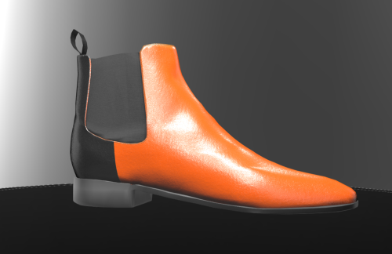

### Images

Images are raster based [PNG's](https://en.wikipedia.org/wiki/PNG), [JPG's](https://en.wikipedia.org/wiki/JPEG) or [JPEG's](https://en.wikipedia.org/wiki/JPEG) that you can curate for use in workflows.

### Uses 
- Build lists of curated images and offer customers the ablility to customise products using images perfectly setup to portray the finished product. Also images used in this process mean that you also can control the quality of the output (printing)
- Use images for product thumbnails where another asset doesnt make sense. E.g. illustration patterns that fill a specific area on the canvas can be displayed as pattern thumbnail image. In a quesiton step where a users choice isnt visually represented on the product display like sizes or extra options, you can use images to provide a visual represenation of the users choice which displays below the step. 
- Product overlays - Where you have a specific product based overlay (Eg. MSDS for chemicals, Barcode or Product based information in general) that needs to be dropped into a workflow that is used across multiple products.
- Silent Illustrations - Where you have a design that is used is a background or as a base image that the user cannot change. 
- Placeholders - Where you want to signify to a user what area their product image will fill on the product. 

### Attributes
- Cannot change colours like illustrations because they are raster based
- Build options using the following option types (illustrations, question step and any product image within an option) 

### Accepted formats 
- PNG's 
- JPG's
- JPEG's 

