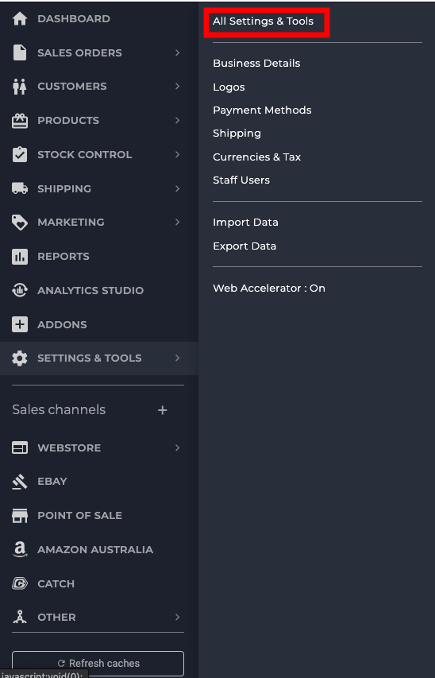
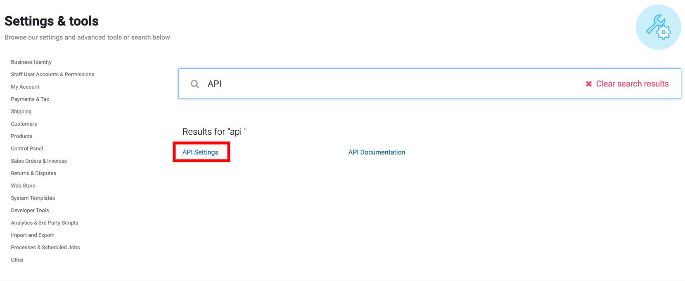
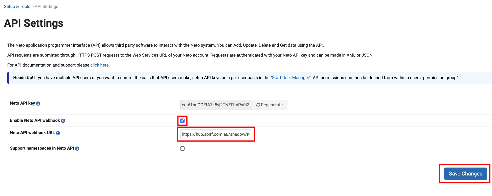

## Install Setup Instructions
For Neto customers, components of the setup will need to be created by the spiff3D integrations team.

## Installation Process
The merchant will install the spiff plugin app from the Neto add-on store which will redirect them to a page asking them to sign into their store account for verification. **Image reference below.**

Once the user enters their details they will then be redirected to the Spiff hub front page with a new integration and partner. **Image reference below.**

You can now explore the hub as you wish! To edit your account details simply head to **Partner → My Account** and you will be greeted with an array of options. **Image reference below.**

### Setting Up The Webhook
To make sure your Neto store is connected to the Spiff webhook you need to navigate back to your Neto store. Once in the store on your left side panel navigate to **All Settings & Tools**. **Image reference below.**

You will be greeted with a search bar where you will enter **API Settings**. Click on it and that will redirect you to a page where we can enable the webhook and enter a custom url that will notify Spiff when an order has been placed. **Image reference below.**

You then need to toggle the **Enable Neto API Webhook** option and you then need to add in the custom webhook url into the **Neto API webhook URL**. That custom webhook url will be **https://hub.spiff.com.au/neto/webhook/{integrationId}**. The integration id value is a unique value for your store. This value is to ensure that Spiff understands what store has hit the url on our side so that we can process the order correctly. After you have added in all details remember to press **Save changes**. **Image reference below.**

### Setting Up Design Product
To set up a design product on Neto we first need to create a parent container product that will hold all the different variants your customers will create. The parent products will be displayed on your store in which customers will use to initialise the **workflow experience**. To do this we need to navigate to the **Products** section inside the Neto c-panel. 

If its your first time adding a new product you want to click that big green button in the middle of the screen to begin the process of adding a parent container for your design products. **Image reference below.**

Otherwise if you have products already created in your store you want to then click the **Add new product** button on the top right hand side of the page to start creating our parent container product. **Image reference below.**

#### Configuring The Parent Product Container
* You want to then toggle **Product with Variations** under **New Product** section
* Toggle **Webstore** under **Sales Channels**
* Toggle **Active** under **Product status**
* Add a **name** for your product under **New Parent Product** (eg. Shoe, t-shirt)
* Add a **price** for your product (This price must be the same price of the spiff product created in hub under Base price) under **Pricing**
* Add a **Image(s)** for the product under **Images**
* Add a **SKU** for your product under **Inventory** (eg. spiff3d)

Any other details that need to be added feel free to do so. To set up the design products this is all the information we are gonna need. Proceed to click **Continue setup** button on the bottom right hand side of the page. **Image reference below.**

