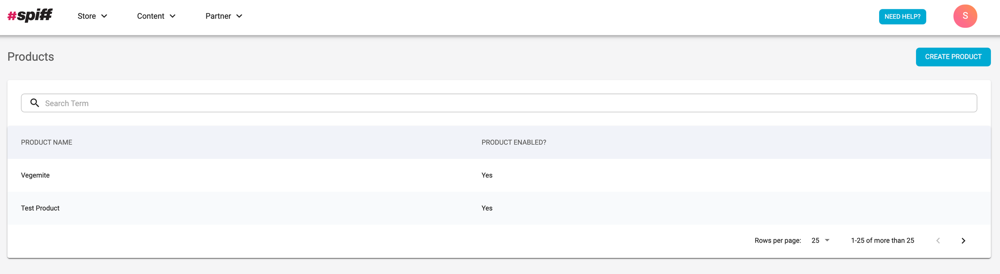

## Install Setup Instructions
For Neto customers, components of the setup will need to be created by the spiff3D integrations team.

## Installation Process
The merchant will install the spiff plugin app from the Neto add-on store which will redirect them to a page asking them to sign into their store account for verification. **Image reference below.**

Once the user enters their details they will then be redirected to the Spiff hub front page with a new integration and partner. **Image reference below.**

You can now explore the hub as you wish! To edit your account details simply head to **Partner → My Account** and you will be greeted with an array of options. **Image reference below.**

## Syncing Spiff Product with Neto Product
The last step to this long journey is to now sync the spiff product created in Hub with your new parent container product. This syncing will allow the button to render on the correct page with the correct workflow it has been assigned.

To do this we need to navigate back to hub by pressing on the **Configure** button on the Spiff add-on in the add-on store. Once in Hub navigate to **Store → Products** via the nav bar and you will either see a list of created products or no products. **Image reference below.**

Click on a product you wish to sync to Neto and scroll down to **Product Integrations**. **Image reference below.**

Add a product integration (which will be the new integration that has been created for you) and press on the 3 dots next to your integration to edit your **External Product Id**. This Id will be the **SKU** you have given to your parent container product in Neto. Press **Save changes** and you should now see your button rendered on the product page in Neto. **Image reference below.**

