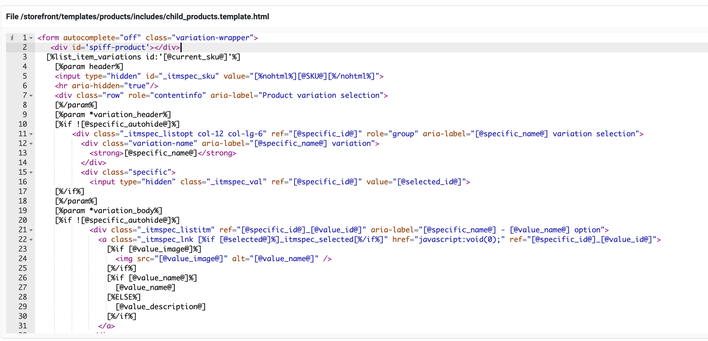

At this point we have successfully created a new parent product but how do we get the spiff button to render on our page so we can click on it and initialise the experience? To do this we need to add some custom code in our Neto Custom Script section. But before we proceed to add our custom code we need to navigate to the **Webstore Templates** section in our Neto c-panel via the **Settings & Tools**. 

Upon clicking into this section we are greeted with the stores template code. We specifically want to edit the product templates. Navigate to Web **Themes → storefront → templates → products → includes → buying_options.template.html**. If successful you should see this page down below.


Press onto any line in the code so we can start editing. If you are on a Mac press **Command + F** and if you are on Windows press **Ctrl + F** to bring up a search bar in the top right hand side of the code. Enter into the search bar **add to cart** to direct you to the correct area of the code we want to edit. **Image reference below.**


Add the block of code below to create a space where we can place our spiff button via the custom script. 

```
<div id='spiff-product'></div>
```

We then want to add the next block of code into the add to cart button tag so we can hide the cart button once our spiff button renders. (If this functionality is unwanted then feel free to skip this step)

```
data-spiff-hide data-product-id="[@SKU@]"
```

Your code should look something like this:


Once we have finished editing this template we want to **save** and navigate back to the template page we were on before. This time navigate to **Web Themes → storefront → templates → products → includes → child_products.template.html**. If successful you should see this page down below.


You want to then add this block of code on line 2. 

```
 <div id='spiff-product'></div>
```

Remember to **save and quit **once you have edited the code.

Your code should look something like this.



We have finished editing the template files. Now we need to navigate to the **Custom Scripts** section via **Settings & Tools** from the left side bar. Then search for **Custom Scripts** and click onto it. If successful you should see the page below.


#### Steps To Add Custom Code
* Press on the **Add New** button to add a new custom script into our store. 
* Name the custom script something like **Spiff-Button-Design-Product**.
* At the bottom of the page press on **Product page (under description)**
* Add this block of code in the field and press **Save** in the bottom right hand side of the page (Follow instructions by Neto to save the script and always double check to see if your changes have been saved)

```
<script type="text/javascript" async src="https://hub.spiff.com.au/cdn/api.js"></script>

<script>
var pageSessionId;
var openDisplayProductWorkflowForProduct[@SKU@];
window.addEventListener('SpiffApiReady', function() {
const product = new window.Spiff.Product({
  integrationId: '[@config:host_name@]',
  productId: '[@sku@]'
});

const hideElements = () => {
           const elements = document.querySelectorAll('[data-spiff-hide]');
           elements.forEach(el => {
               const externalProductId = el.getAttribute('data-product-id');
               if (externalProductId === '[@sku@]') {
                   el.style.display = 'none';
               }
           });
       }

 product.on('ready', () => {
             hideElements();
             const buttons = document.querySelectorAll('.spiff-api-button[data-product-id="[@sku@]"]');
console.log(buttons);
             if (pageSessionId === undefined){
                pageSessionId = window.Spiff.Analytics.createPageSession();
             }
             for (button of buttons) {
                 button.style.display = 'block';
             }
       });
       product.confirmActive();

openDisplayProductWorkflowForProduct[@sku@] = (event) => {
           event.target.disabled = true;
           event.preventDefault();
           event.stopPropagation();

            const spinnerSvg = document.createElementNS('http://www.w3.org/2000/svg', 'svg');
            spinnerSvg.setAttribute('height', event.target.clientHeight * 0.4);
            spinnerSvg.setAttribute('width', event.target.clientHeight * 0.4);
            spinnerSvg.setAttribute('viewBox', '0 0 66 66');
            spinnerSvg.animate([{transform: 'rotate(0deg)'},{transform: 'rotate(360deg)'}], {duration: 1000, iterations: Infinity});
            const spinnerCircle = document.createElementNS('http://www.w3.org/2000/svg', 'circle');
            spinnerCircle.setAttribute('cx', 33);
            spinnerCircle.setAttribute('cy', 33);
            spinnerCircle.setAttribute('fill', 'none');
            spinnerCircle.setAttribute('r', 30);
            spinnerCircle.setAttribute('stroke', 'black');
            spinnerCircle.setAttribute('stroke-width', 6);
            spinnerCircle.style = 'stroke-dasharray:45 180;';
            spinnerSvg.appendChild(spinnerCircle);
            event.target.appendChild(spinnerSvg);

           const transactionOptions = {
               presentmentCurrency: '[@config:defaultcurrency@]',
               product: product,
               shouldCreateDesignProduct: true,
               pageSessionId
           };
           const transaction = new window.Spiff.Transaction(transactionOptions);
           transaction.on('quit', () => {
               event.target.removeChild(spinnerSvg);
               event.target.disabled = false;
               console.log("The user exited before completing their design");
           });
           transaction.on('complete', async (result) => {
           document.getElementById("spiff-product").innerHTML = `
                    <input type="hidden" id="spiff_sku" value='${result.designProductId}' />
                     <input type="hidden" id="spiff_qty" value='1' />
              `;
             $.addCartItem('spiff_sku','spiff_qty');
             event.target.removeChild(spinnerSvg);
             event.target.disabled = false;
           });
           transaction.execute();
       };
});
</script>
    <script>
        document.getElementById("spiff-product").innerHTML = `
            <button
                    class='spiff-api-button'
                    id='spiff-product'
                    data-product-id='[@sku@]'
                    onclick="openDisplayProductWorkflowForProduct[@sku@](event)"
                    style="display: none;color:#ffffff;background-color:#e12929;border-radius:4px;height:46px;width:100%;font-size:16px;font-family:Barlow,Arial,Helvetica;font-weight:600;"
                >
                Customise Now
               </button>
        `;
    </script>
```
