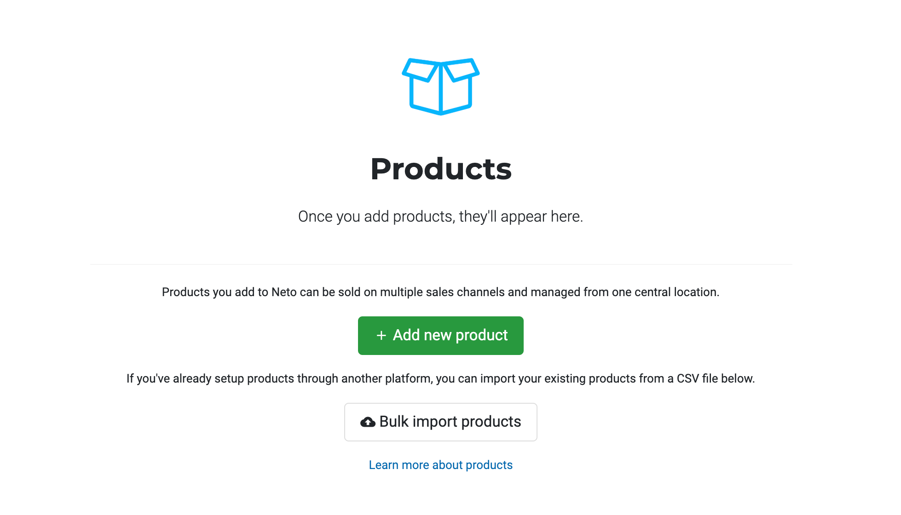
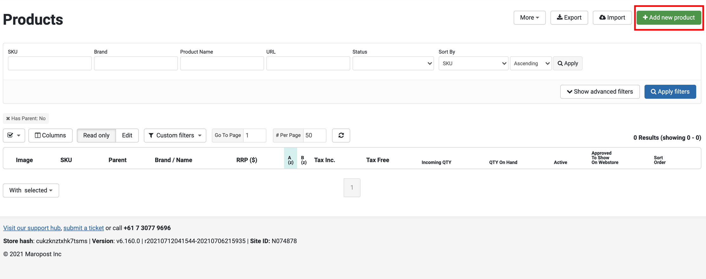
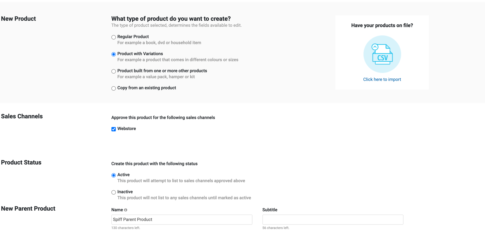
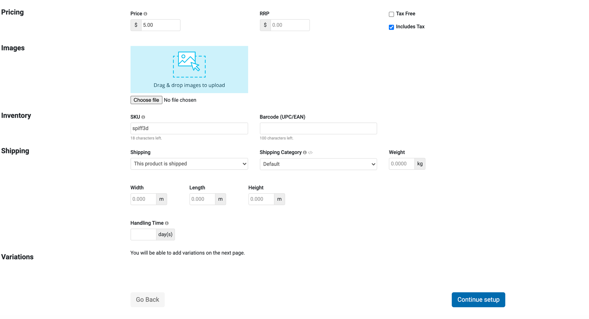

To set up a design product on Neto we first need to create a parent container product that will hold all the different variants your customers will create. The parent products will be displayed on your store in which customers will use to initialise the **workflow experience**. To do this we need to navigate to the **Products** section inside the Neto c-panel. 

If its your first time adding a new product you want to click that big green button in the middle of the screen to begin the process of adding a parent container for your design products. **Image reference below.**

Otherwise if you have products already created in your store you want to then click the **Add new product** button on the top right hand side of the page to start creating our parent container product. **Image reference below.**

#### Configuring The Parent Product Container
* You want to then toggle **Product with Variations** under **New Product** section
* Toggle **Webstore** under **Sales Channels**
* Toggle **Active** under **Product status**
* Add a **name** for your product under **New Parent Product** (eg. Shoe, t-shirt)
* Add a **price** for your product (This price must be the same price of the spiff product created in hub under Base price) under **Pricing**
* Add a **Image(s)** for the product under **Images**
* Add a **SKU** for your product under **Inventory** (eg. spiff3d)

Any other details that need to be added feel free to do so. To set up the design products this is all the information we are gonna need. Proceed to click **Continue setup** button on the bottom right hand side of the page. **Image reference below.**

