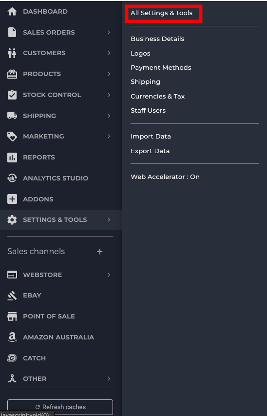
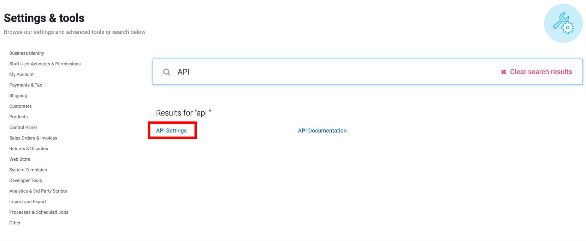
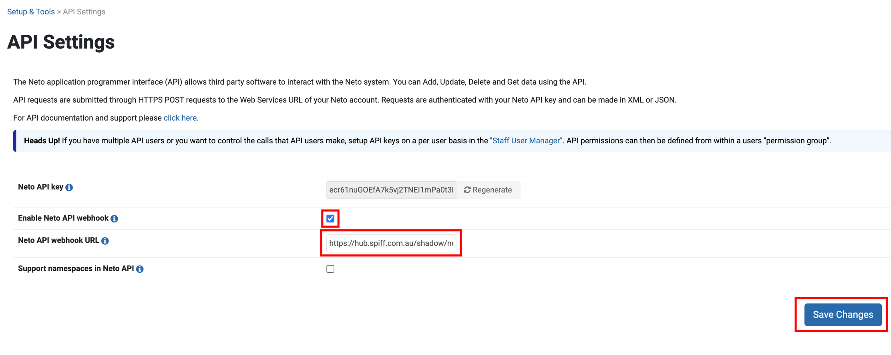

To make sure your Neto store is connected to the Spiff webhook you need to navigate back to your Neto store. Once in the store on your left side panel navigate to **All Settings & Tools**. **Image reference below.**

You will be greeted with a search bar where you will enter **API Settings**. Click on it and that will redirect you to a page where we can enable the webhook and enter a custom url that will notify Spiff when an order has been placed. **Image reference below.**

You then need to toggle the **Enable Neto API Webhook** option and you then need to add in the custom webhook url into the **Neto API webhook URL**. That custom webhook url will be **https://hub.spiff.com.au/neto/webhook/{integrationId}**. The integration id value is a unique value for your store. This value is to ensure that Spiff understands what store has hit the url on our side so that we can process the order correctly. After you have added in all details remember to press **Save changes**. **Image reference below.**

