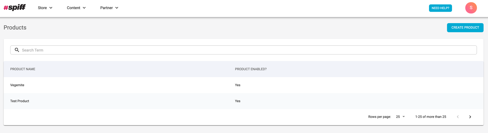
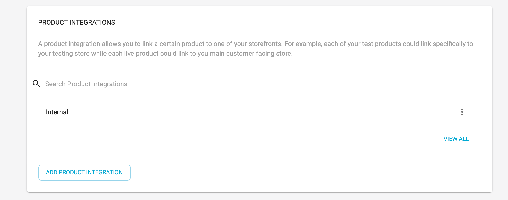
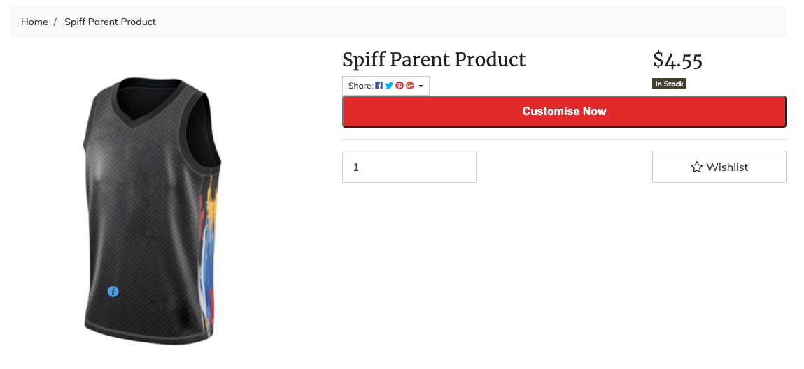

The last step to this long journey is to now sync the spiff product created in Hub with your new parent container product. This syncing will allow the button to render on the correct page with the correct workflow it has been assigned.

To do this we need to navigate back to hub by pressing on the **Configure** button on the Spiff add-on in the add-on store. Once in Hub navigate to **Store → Products** via the nav bar and you will either see a list of created products or no products. **Image reference below.**

Click on a product you wish to sync to Neto and scroll down to **Product Integrations**. **Image reference below.**

Add a product integration (which will be the new integration that has been created for you) and press on the 3 dots next to your integration to edit your **External Product Id**. This Id will be the **SKU** you have given to your parent container product in Neto. Press **Save changes** and you should now see your button rendered on the product page in Neto. **Image reference below.**

