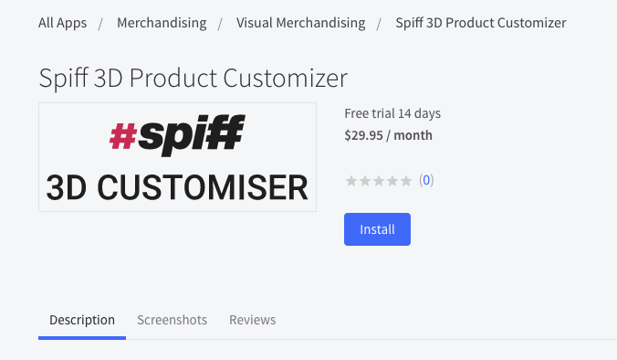
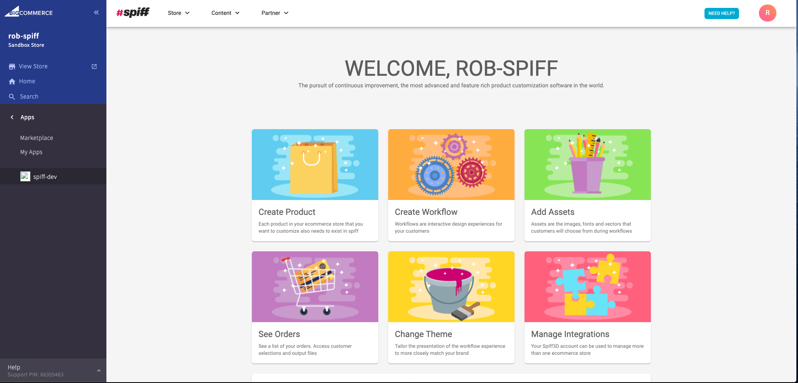

## Installation Process

The merchant will install the Spiff plugin app from the Bigcommerce marketplace. The Spiff page looks like the image reference below.

You will be redirected to the front page of the Spiff app where you can install Spiff.

You will then need to confirm to give Spiff access to your BigCommerce store. All the desired scopes Spiff needs to be able to access from your store are listed on the page.

Having succesfully installed, you will be automatically directed via an iframe to the Spiff Hub where you will create your first product onboarding. The primary goal of this process is to have you:

* Select a **product** from your store that you want to **Personalize/Customize**
* **Create a workflow** - Configurable steps that build the customer journey
* Order content required to execute this experience or link to existing public asset.
* **Choose a Plan** (You can start on the teaser with free trial)
* Test - Display a 3D product with steps using spiff in your store

Next Step:

[Onboarding](https://help.spiff.com.au//quick-start/onboarding)