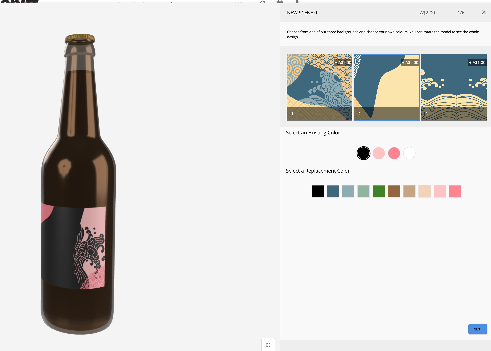
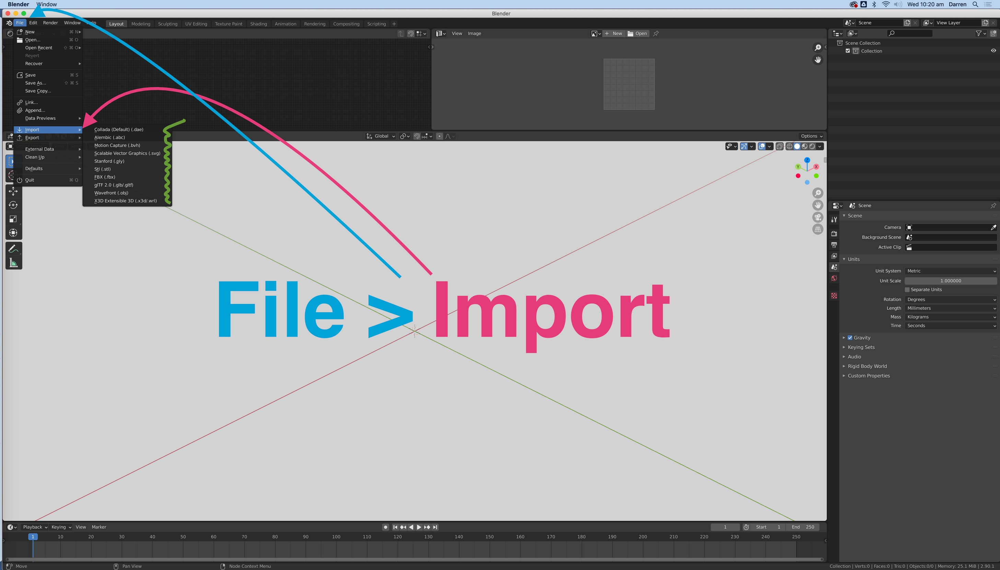
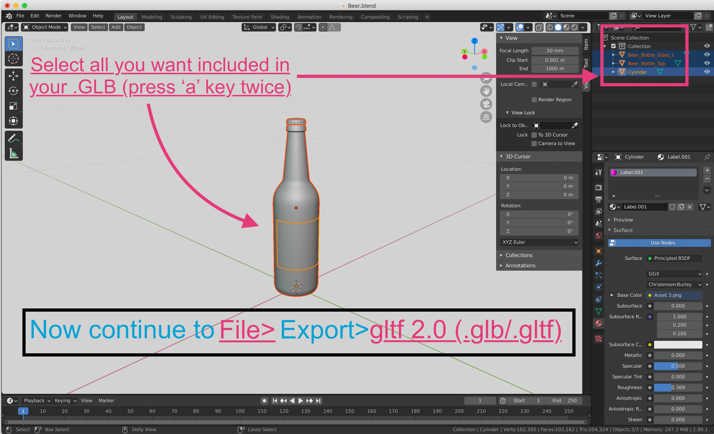
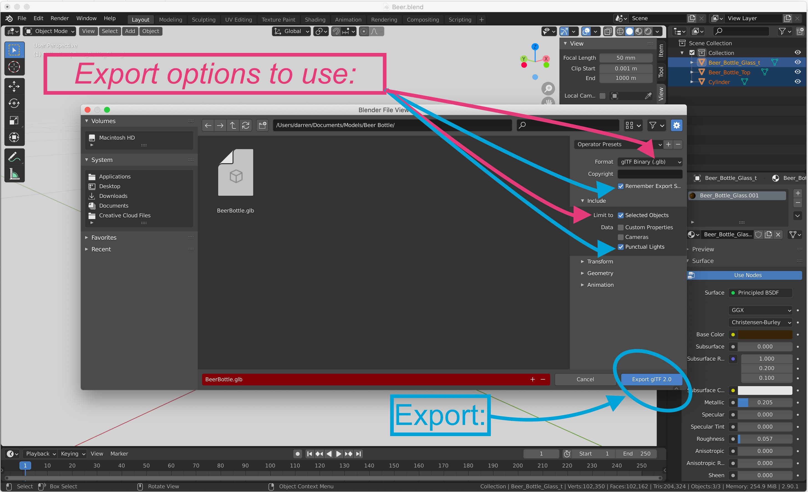
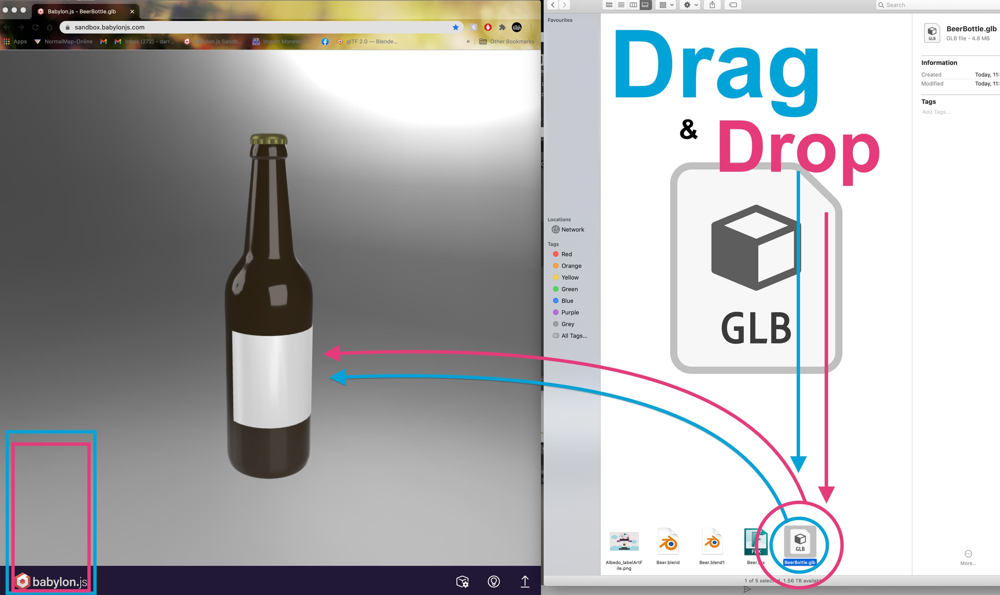

When converting your 3D model to work with the #SPIFF editor, we use the Blender 3d Toolset. Since the models used on our editor are going to appear across various devices, including mobile, there are some steps we need to take to ensure it all works as it should.  Understanding the Blender program; where everything is, can daunting without context, we’ll guide your through it. (See attached) 

## Getting to the right format
note: sometimes a fresh blender file can include a cube object in the scene. removing this is as simple as left clicking it, and deleting it with the delete key.

For #SPIFF, the file format “.glb” is required, this format is quickly becoming the industry standard for online & mobile experiences for its efficiency and speed. Although .glb is the only acceptable format to the #SPIFF editor itself, we can convert to it from more conventional formats with ease. 

In order to import your model to Blender, to further convert, it's as simple as opening Blender, and then navigating to File>Import>, and then searching for your model file. This works like most other softwares' import feature. For this example we will import a .FBX file. 

## Collect for Export
note: it’s really helpful at this point to save this blender file for later use. through File>Save> 

Now that you’ve imported your model, we can easily get an overview on the imported model and continue to export it in the .GLB Format. 
All we need to do is select all of the objects we would like to include in our GLB. (The object itself, lights etc.) and then proceed to export it. That simple! 

## Check it out!
Now that we have exported our model to the .GLB Format, we can quickly and easily view it in an 
to make sure it all works correctly before uploading to spiff.  We use the [Babylon.js](https://sandbox.babylonjs.com/) Viewer.

## Finalisation
Now that we’re all converted we are ready to upload to #SPIFF and gain some serious traction on our personalisation adventure! Of course there are a variety of other things to look through with our 3D Model before exporting, but this is basic first step to set things up. [**Next we will cover how to attach textures & setup materials for the GLB platform.**](https://help.spiff.com.au/)