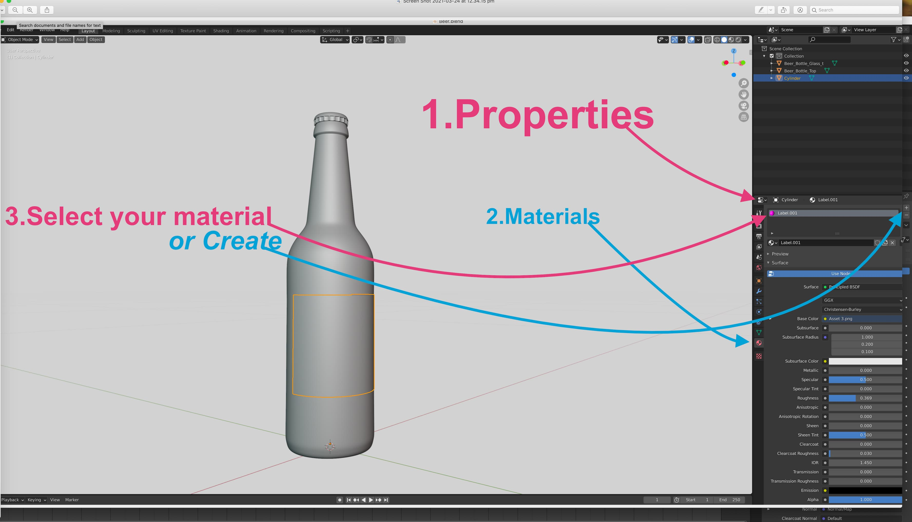
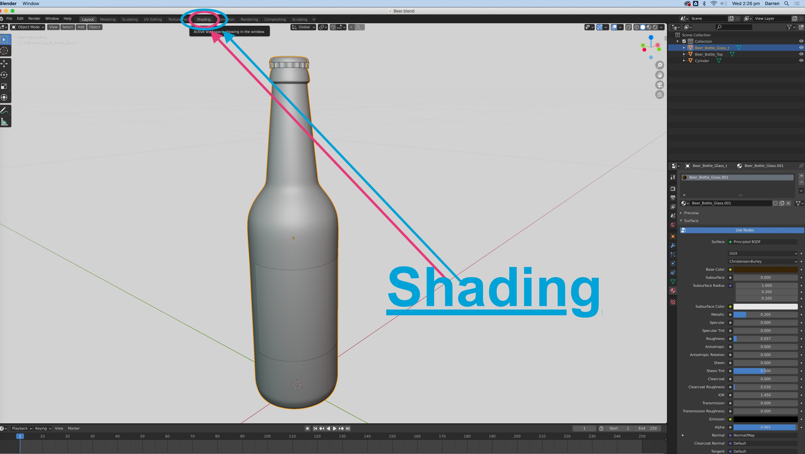
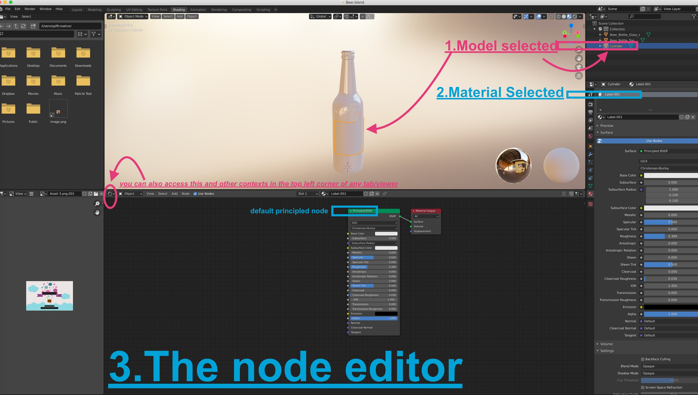
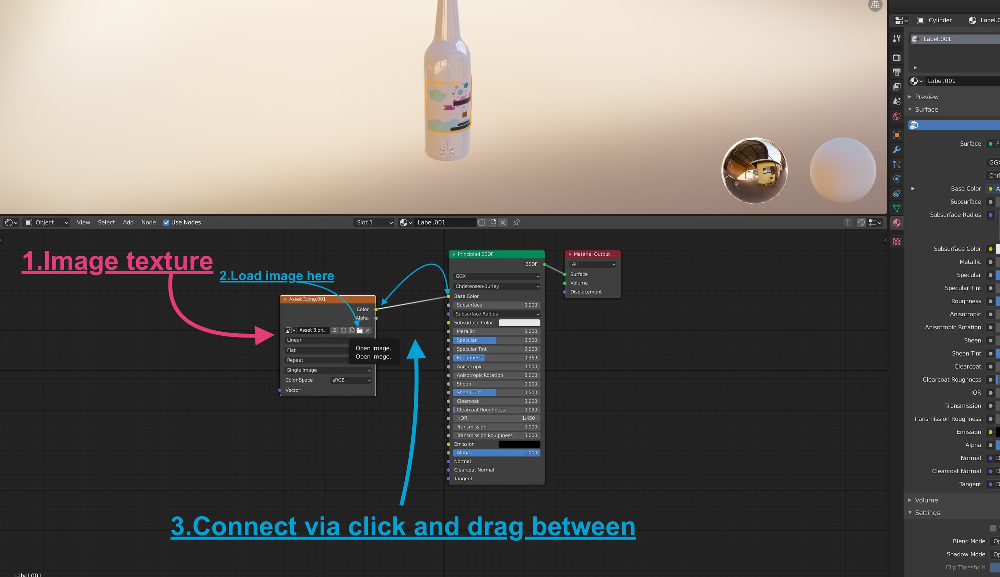
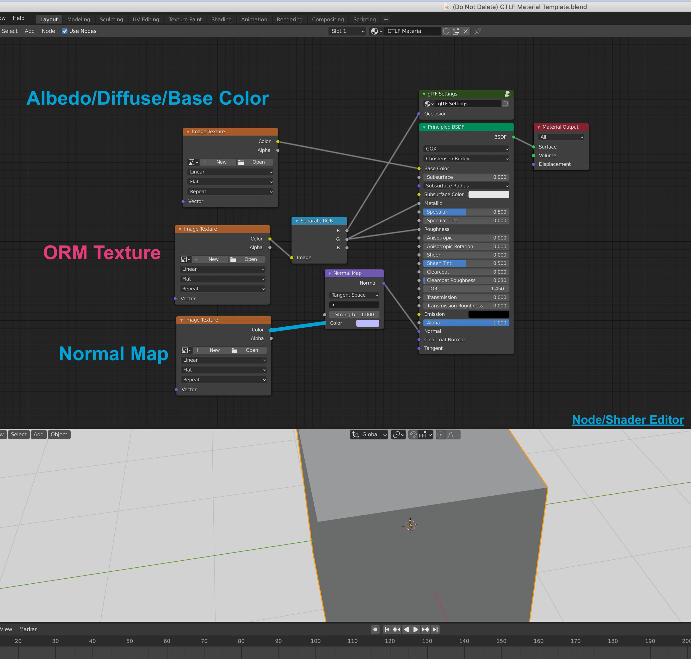
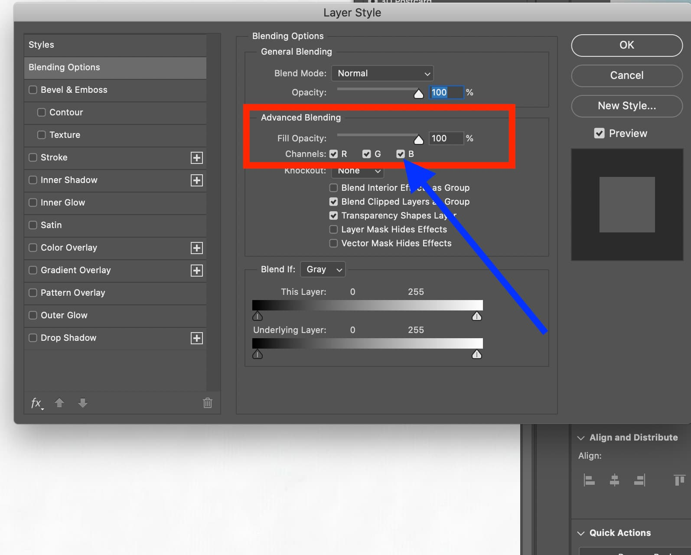
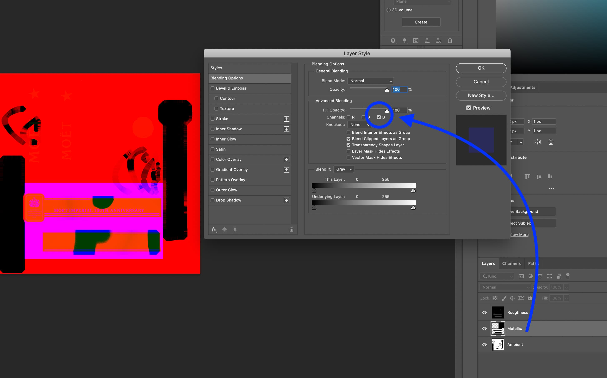

The **.glb/.gltf** model format supports full [PBR](https://en.wikipedia.org/wiki/Physically_based_rendering)(Physically-Based-Rendering) material support when used correctly. In this page we explain the setup for these materials using the standard [Blender](https://www.blender.org/) 3d software.

## Finding your Materials
Continuing from the [.GLB Conversion](https://help.spiff.com.au/setting-up-3d-models-for-spiff/converting-a-3d-model-to-glb ) document, we can navigate to our blend file that we saved earlier, or alternatively re-import your model file to a fresh blender file. 

Within blender, we can select the objects that we want to create, or otherwise adjust materials on. In this case we will select the object we want to inspect (Left Click it), and then navigate to the materials sections of the properties tab. (See attached) Make sure you are in ‘Object Mode’ while doing this. Or, if in edit mode, you can select specific mesh of the object and assign a material to that section. You can switch between these nodes with **CTRL+TAB.**

Now that we have found the materials tab, we can create, remove, and edit any materials applicable to the product. It’s important to note that these should be named appropriately with context for later ease-of-use in #SPIFF. (For example, a bottle label, should have a material name of “Label”, or “Label1” etc. depending on context.)

## Understanding The Node Editor
Blender is shipped with a powerful and versatile **node editor** by default. Any **materials** you want to create can be manipulated with ease in this area and set up correctly for the .GLB platform. The easiest way to access the node editor is by click the **“Shading”** layout. in the top toolbar of the blender window (See below)

Take your time after changing the layout, assess where everything is etc.

Though there is a magnitude of options within this area, we will just keep the default “Principled BSDF” node that is created by default with each new material.

An important thing to keep in mind, is that you will only be able to access the nodes of a **material** you have **selected**, attached to a **model** you have selected (Referring again to that material tab in the bottom right panel, in properties). If no model is selected, you cannot see its attached materials etc.

New nodes can be added with ‘SHIFT+A' when in the node editor. Or alternatively, press 'add’ in the top toolbar of that node editor frame/window. In these examples we will only be using “Image textures”. Which will be accessed via **SHIFT+A(or add)>Texture>Image Texture.** This type of node, and any other, can be connected, or linked to other nodes, by clicking and dragging from the small points/dots on each node, where it makes sense.

Node editors aren't a Blender-exclusive system, but for this case, and continuity sake, we will just show the blender context of this topic.

## Composing a basic material [Simplified]
In this case, we are simply creating our ‘label’ material. For our basic label, we will add a image texture, and connect this to the **“Base Color”** node connection on the **‘Principled BSDF’** **(Shift+A>Texture>ImageTexture).**

Now that we have our desired texture applied, and we can inspect how it appears on the model in the upper window you can see above, we can say that this specific material is finished. We can play with those blue slider values in the principled bsdf node, like roughness, metallic, clearcoat etc. to adjust the overall substance of the material too, if applicable. So metal, for instance, will have very low roughness and very high metallic values

for our specific label material, we have UV-Unwrapped that currently selected object. to specific dimensions, that respect the label height, width, and bleed information. Please refer to the **UV Unwrapping to a Label or Forme** section.

## Composing a Complex material [Advanced]
In order to achieve more complex or more realistic looking materials, we can compose an array of nodes for each individual texture type. The standard textures included in the PBR material format, are **Normal, Metallic, Roughness, and Ambient Occlusion maps.** As well as Alpha maps (for transparent/see-through materials) 

In most industry-standard 3d models, the Ambient Occlusion, Roughness, and Metallic maps, can be combined into a “ORM texture” That is, Occlusion, Roughness. Though this is not always necessary in cases where one or another texture from that set is unused, then you can use individual image textures. (For example, it has a roughness and ambient map, but no metallic map). Refer to the tips after this step for more info on ORM textures

This is the standard composition of a PBR node array that will work when exported for the .GLB(Babylon) format. (See below)

The normal map image texture in you blender node tree will require a **normal map node (SHIFT+A>Vector>)** set to a Tangent Space. And in order for your ORM texture to be used by Blender correctly, a seperate RGB Node will be added **(SHIFT+A>Converter>).**  

Blenders BSDF Node has one drawback, wherein it does not have a node connection for Ambient Occlusion. An **empty node-group** must be created, named and labeled **“glTF Settings”** connect your red channel from your ORM texture to this to export the model with the ambience. It's important that the node is **named exactly that way** with that capitalisation or it wont register the ambient map. 

## Tip: Creating ORM Textures
The ORM Texture is a standard RGB image that just has each texture map included in a seperate channel, for efficiency, wherein the Red channel is used for Ambient Occlusion, the Blue is used for Metallic/Metalness, and the Green channel is used for Roughness. This can bring down filesize quite drastically as you only need the one final ORM texture rather than three individual texture files. 

Assuming you have all three texture files, you can easily pack it into an ORM texture with Photoshop, On each individual layer, you can go to advanced blending options and make that layer only respect one color channel. The ambient texture you load in, for example, will only have the R (red) channel selected, or Metallic, b (Blue). (See below).

