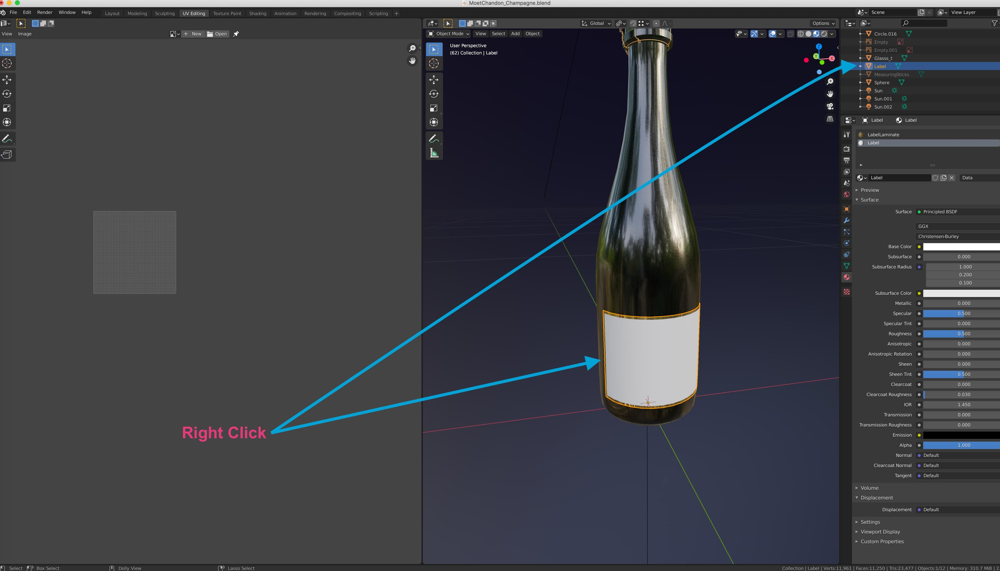
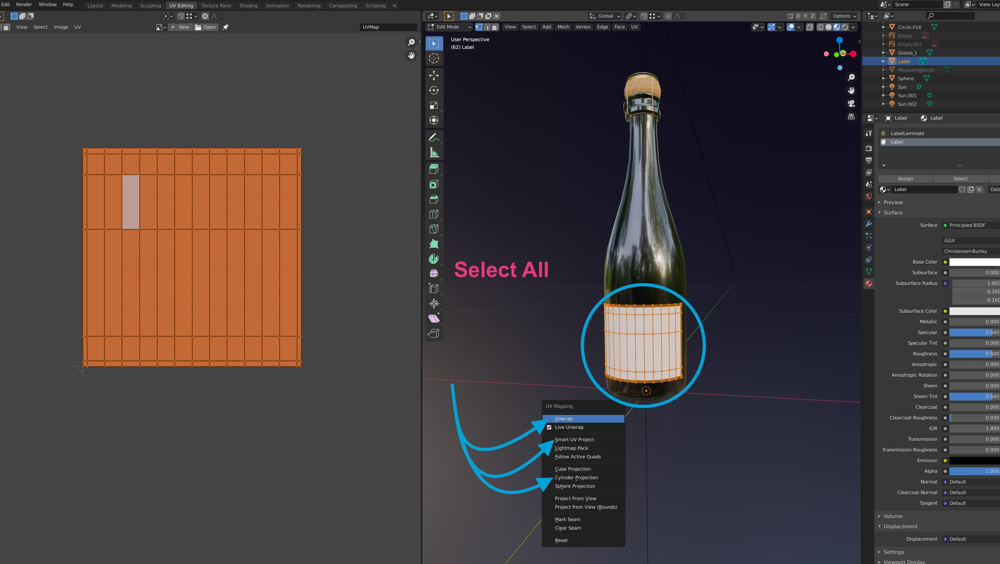

In order to visually show your design or personalisation on your model, it must be “UV Mapped” accordingly. 

UV mapping is simply the way a **2d image**, or design, is ‘projected’ or layered across a section of a **3d area**. Just like creating and laying a Label across a real physical bottle, you need to create a physical Label section in the 3d Space thats the necessary height/width/and shape for the job. 

In the case of unwrapping this area, however, you are doing the opposite in a sense. Instead of laying the label across the bottle, you are laying this section of mesh you have made across the image file of the label. Another way to look at it, is that you are using the mesh itself as a clipping mask on an image, and you need to decide how the image will appear in your clipping mask. 

## Accessing The UV Editor
In Blender, with your model imported, you can access the UV Editing workspace by clicking ‘UV Editing’ in the workspace selector at the top of your standard default blender workspace. 

## Getting to Edit mode and selecting your label area
In the right hand side of the UV Editing workspace, using the 3D Viewport, you can left click the object you wish to UV Unwrap, then verify its selected in the top right **outliner.** (See below) 

From here, you can press **TAB** to change context in the 3D viewport, and change to **'Edit Mode'**

## Selecting mesh and techniques for UV mapping
In edit mode (use TAB in the 3d viewport) , you can select all of your meshed section with the ‘A' key. double tap the ‘A’ key if it doesn’t select everything first shot or if a face of the mesh was already selected. prior. (Because ‘A' in this case will deselect all). You will know if something is selected if it is highlighted orange.

After you’ve done this, you can now access the **UV Mapping menu.** Simply hit the ‘U' Key and then you can choose a specific UV unwrapping option. Theres a range of options that are really handy for certain types of models.  If you have a chest, or a box for example, a Cube Projection will be the most useful since it will automatically unwrap your selected mesh with that in mind. 

Since the Label that we are unwrapping is a simple flat piece with no extruded faces or complicated mesh, we can simply hit the 'Unwrap’ option, and it will lay our piece flat into the UV Editing canvas.

## Moving, scaling, and rotating UV ‘Shells’
In the 3D Space, the sections of UV mapping that you take from the 3d object are referred to as ‘UV Shells’. You can click-Drag, select, scale, move, and rotate these pieces, just like you can do with the 3d model itself. Just think of the UV sections as literally being the pieces of the model itself, just laying flat in 2d. Since our bottle’s label was made with a height and width that reflects a print file/design made for the real life product. Since this print file is just the dimensions of the label only, we can unwrap this label section and scale it to cover the entire canvas, as seen above. 

(See below for an example of a complex set of UV shells)

With the glass selected, as opposed to the label section, you can see that we have unwrapped it into fragmented pieces. This is necessary for large or complex sections of models where a simple unwrap will not work correctly. Seamless textures can be applied to these sorts of areas, follow the [Material setup](https://help.spiff.com.au/setting-up-3d-models-for-spiff/setting-up-materials-for-glb-file-exports-from-blender ) document for more info on connecting textures and creating materials.

## Exporting your model with UV maps
In order to export the model with it’s UV map, we actually dont need to do any extra work. The UV Data is internal to the object so it will automatically export with your 3d model!

Models can actually have multiple different UV maps attached, this is handy for baking certain textures into different shapes or layouts. When exporting to .GLB however, you need to only use one UV map **per object.** (For example, the label will have 1 UV map, not two. The glass will have 1 UV map, not two etc.)

