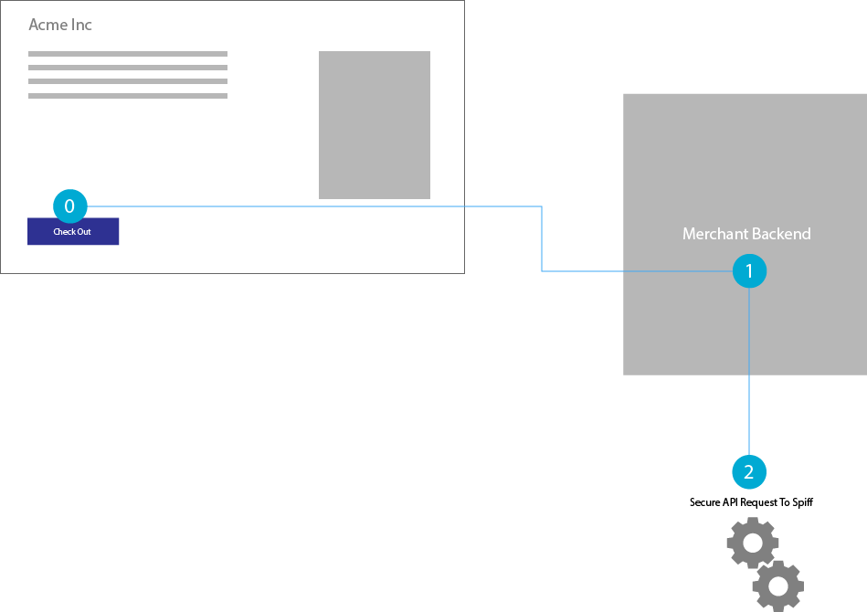

## Overview
The Spiff API allows you to execute the full customistion lifecycle of a product. This life cycle consists of two phases and involves the creation of two distinct entities. The first phase is based inside the user browser and executed via javascript most commonly on a eCommerce store front. This phase is executed by the customer anonymously and it's result is a transaction that is stored within the Spiff cloud.  The second phase takes this created transaction and orders it confirming the customer order has been executed by the merchant who owns the customer. When executing the second phase the order creation must include the `transactionId` provided by the execution of the first phase. It is this this `transactionId` that links the user customisation to an order.

It is up to the developer of the integration to store the `transactionId` between phases in order to provide it for the order to be executed. Many existing integrations store the `transactionId` with the line item in their order allowing more than one customisation to be ordered form with in the same cart.

## Phase 1 : Transaction
The first step in the customisation of any product is creating a transaction. A transaction is created publicly and stored with a design in spiff. Note the user does not need to be logged in our have an account with spiff to create a transaction. To create a transaction the front end javascript API of spiff will need to be called. This front end API should be loaded from our CDN in to the merchant store front end web page. For full details on using this API and creating a transaction please refer to the [Javascript API](/developer) page.

```
https:://assets.spiff.com.au/api.js
```


## Phase 2: Order
Once a design has been completed and a `transactionId` returned this transaction can then be ordered.  For transactions to be processed they must first be ordered. For a typical e-Commerce integration this would take place once the user has rendered payment to the merchant for their prodcuts. Unlike creating a transcation which is done anonymously spiff orders are created on the behalf of a merchant. As a result a spiff order must be placed via a server to server https request that has been sgined with a client key and secret. Details of this request as well as how to sign the request are included below.  Note: It is recommended not to place this order on spiff until the store can confrim that the customer payment has been rendered.



### Example Orders Request
```
POST /api/v2/orders HTTP/1.1
Host: api.spiff.com.au
Date: Mon, 23 Apr 2012 12:45:19 GMT
Authorization: SOA df8d23140eb443505c0661c5b58294ef472baf64:jHX6oLeqTXpynyqcvVC2MSHarhU
Content-Type: application/json
{
    "autoPrint":false,
    "orderItems":[
        {"amountToOrder":1,"transactionId":"e3ac7f3a-a117-46d7-a5f0-232fbc7cfe38"}
    ]
}
```

## Signing Requests
All server side requests such as creating orders must be signed in order to be performed. Signing a request must be done by appending a base64 encoded signature string to an auth header with the client key. See below for an example of what this header should look like.

```
Authorization: SOA  ${ClientKey}:${Base64EncodedRequestSignature}
```

The request signature is computed from a hmac hash value of the following appeneded strings. To generate this hash the client secret should be used as the hash key.

```
${RequestMethod}\n${MD5(RequestBody)}\n${RequestContentType}\n${RequestDate}\n${RequestPath}
```

See this [example implementation of this operation](https://github.com/spiffdev/DeveloperPortal/blob/master/clients/php/woocommerce/spiff-connect/spiff-connect.php).