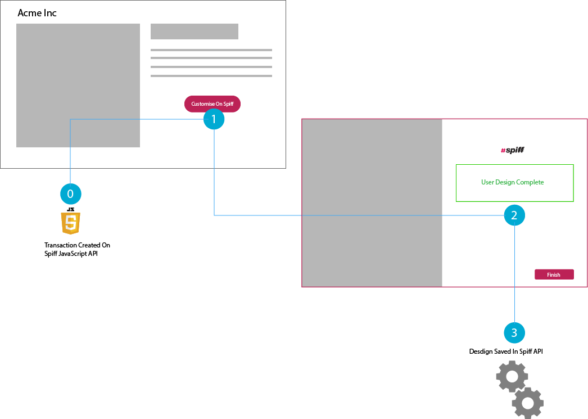

# Integrations

## Overview
The Spiff API allows you to execute the full customistion lifecycle of a product. This life cycle consists of two phases and involves the creation of two distinct entities. The first phase is based inside the user browser and executed via javascript most commonly on a eCommerce store front. This phase is executed by the customer anonymously and it's result is a transaction that is stored within the Spiff cloud.  The second phase is takes the form of a secure API call confirming the customer order and is executed by the merchant who owns the customer.

## Phase 1 : Transaction
The first step in the customisation of any product is creating a transaction. A transaction is created publiclly and stored with a design in spiff. To create a transaction the front end javascript API of spiff will need to be called. This front end API should be loaded form our CDN in to the merchants web page.



## Phase 2: Order

### Example Orders Request
```
POST /targets HTTP/1.1
Host: api.spiff.com.au
Date: Mon, 23 Apr 2012 12:45:19 GMT
Authorization: VWS df8d23140eb443505c0661c5b58294ef472baf64:jHX6oLeqTXpynyqcvVC2MSHarhU
Content-Type: application/json
{
  "name":"tarmac",
  "width":32.0,
  "image":"0912ba39x...",
  "application_metadata":"496fbb6532b3863460a984de1d980bed5ebcd507"
}
```

## Signing Requests

